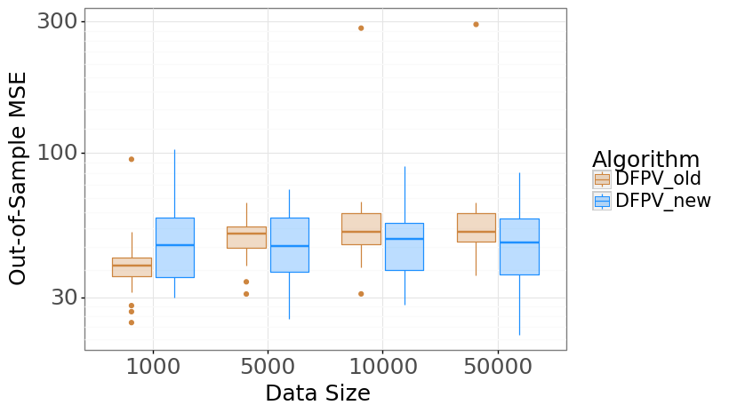

# DeepFeatureProxyVariable
Code for "
Deep Proxy Causal Learning and its Application to Confounded Bandit Policy Evaluation" (ICLR2023) (https://arxiv.org/abs/2106.03907)

# Update from Neurips [Camera Ready version](https://proceedings.neurips.cc/paper/2021/file/dcf3219715a7c9cd9286f19db46f2384-Paper.pdf)
As found in [Kompa et al. 2022](https://arxiv.org/pdf/2205.09824.pdf), our old code may suffer from numerical instability in the Demand design experiment. This occurs because we applied ReLU activation at the final layer of features and they can all be zero during in the training. We updated our code to remove this final activation, which not only resolve numerical instability but also slightly increases the performance



To ensure reproducibility, we keep the old neural net structure in ``src/models/DFPV/nn_structure/nn_structure_for_demand_deprecated.py``. You can replace ``src/models/DFPV/nn_structure/nn_structure_for_demand.py`` with it to reproduce the results in ICLR paper.

## How to Run codes?

1. Install all dependencies
   ```
   pip install -r requirements.txt
   ```
2. Create empty directories for logging
   ```
   mkdir logs
   mkdir dumps
   ```
3. Run codes
   ```
   python main.py <path-to-configs> <problem_setting>
   ```
   `<problem_setting>` can be selected from `ate` and `ope`, which corresponds to ate experiments and policy evaluation experiments in the paper. Make sure to input the corresponding config file to each setting. The result can be found in `dumps` folder. You can run in parallel by specifing  `-t` option.
